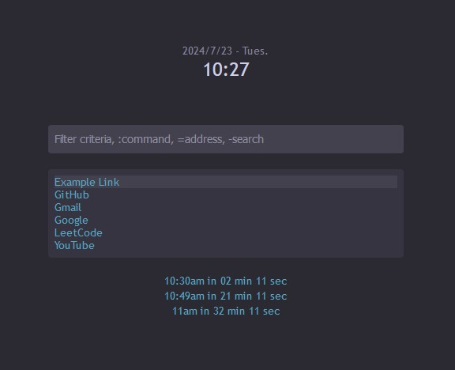

# Homepage Omni

A custom, lightweight homepage/new tab browser extension that lets
you create and access quick links via an omnibar

- Productive: keyboard-based mouse-free interaction, available at any new tab page
- Customizable: add any links, create events, change colors, etc. through a portable config file
- Simple: no complicated graphics or bulky UI elements
- Private: nothing you type in the bar is recorded until you hit enter

*A configured screenshot showcasing many features, using* `examples/feature_showcase_config.json`



## Installation

This extension works in both Firefox and Chrome, but is mostly tested in Firefox as my personal homepage.

To add the extension to Firefox:
1. Go to the [GitHub releases](https://github.com/Cadecraft/HomepageOmni/releases) in Firefox and click on the `.xpi` file to install the latest version

To test out the extension on Firefox (e.g. for development):
1. Download this source code
2. In Firefox, go to `about:debugging`
3. Go to the This Firefox section and click `Load Temporary Add-on...`
4. Upload this `manifest.json` file.

To add the extension to Chrome:
1. Download this source code
2. Go to `chrome://extensions`
3. Turn on Developer Mode in the top right
4. In the top left, Load Unpacked and upload this entire folder

This project will be released (signed and published) once it becomes more complete, then there will be better installation instructions. If you experience problems or have suggestions, feel free to create a GitHub issue.

Keep reading to figure out how to configure Homepage Omni!

## Preface

Since this extension's goal is to be highly configurable while staying lightweight,
**learning and configuring it can be complicated!**

Take your time learning the simple commands with the default config, then once you want
to customize something, type `:export` to download your `.json` file, open it in a text editor, then read about anything you
want to change here in this readme.

The documentation might be intimidating, but it's actually a lot simpler in practice.

## Commands/controls

Type any string in the omnibar to filter through the list of links (described below); press `enter` to go to the selected link.

The `up` and `down` arrow keys can be used to select between links from the filtered list; by default, the first one is selected.

Commands are prefixed with `:`.
- `:set {link name} {link URL}` - Add or change a link with the given name
- `:delete {link name}` - Delete the link with the given name
- `:show` - Show all links by default (when the omnibar is empty)
- `:hide` - Hide all links by default
- `:export` - Export/save the configuration to a .json file
- `:import` - Import/load the configuration from a .json file
- `:resetconfig` - Reset the entire configuration (useful if corrupted)

<!-- TODO: version command -->

Addresses are prefixed with `=`.
- `=example.com` - Go to https://example.com

Web searches are prefixed with `-`.
- `-marsupials` - Google search for "marsupials"

Templates (see below) are prefixed with `+`.
- `+mytemplate 1` - If you configured it, this will open a specified URL with the argument 1

## Configuration file

<!-- TODO: document better -->

The configuration (the list of links, your settings, etc.) can be exported, edited, and imported as a `.json` file.
For some advanced configuration, you cannot use the omnibar commands and must edit the file manually.

This configuration is automatically locally stored in your browser whenever you import it, reset it, or make a change.

If your configuration ever gets corrupted, use the `:resetconfig` command.

If you want to load a configuration you found from someone else, please read it and ensure it is trustworthy.

### Configure Links and bar:
- `display_when_empty` - bool (default `true`; whether to show all links by default when the omnibar is empty)
- `bar_placeholder` - the placeholder text that appears in the omnibar
- `links` - a list of link objects (see below)

Link object format example:
```json
{
    "key": "Example Link",
    "href": "https://example.com"
}
```
*Note: as a best practice, use common sense for naming links, like don't start them with* `=` *or* `-` *and don't add extra spaces.*
*Also, spaces should not be used in link hrefs.*

### Configure Events:
- `events` - a list of event objects (see below)
- `event_display_duration_mins` - integer (default `60`; how many minutes before an event to display a countdown at the bottom)

Event object format example (creates an event Lunch Time at 12:25pm repeating each work weekday):
```json
{
    "name": "Lunch Time",
    "hr": 12,
    "min": 25,
    "rep": "MTuWThF"
}
```
*Note: hours are from 1 to 23; weekdays are 'Su', 'M', 'Tu', 'W', 'Th', 'F', and 'Sa'; if "rep" is not defined the event always repeats.*

### Configure Clock:
- `clock1_name` - the name of the main clock (center), which shows local time (default `""` (empty string))
- `clock2_name` - the name of the second clock (left) (default `"hidden"`)
- `clock2_utc_offset` - the UTC offset of the second clock (ex. for Tokyo, which is UTC+9, use `+9`)
- `clock3_name` - the name of the third clock (right) (default `"hidden"`)
- `clock3_utc_offset` - the UTC offset of the third clock

If you set the name of a clock to be `"hidden"`, it will not appear; to hide all clocks, set them all to `"hidden"`.

No matter what you change in this section, your local time will be used for the countdowns to events.

If you choose to use multiple clocks, it is recommended to set Clock 1's name to `"Local"` for clarity.
Make sure you've researched the right UTC offset for any cities you want to add!

I find that adding a related emoji to clock titles helps improve the appearance of the page as a whole.

### Configure Search:
- `search_url_prefix` - the search engine URL you want to use (the part that comes before `?q=`) (default `"https://google.com/search"`)

### Configure Theme:
- `theme` - an object/dictionary of variable settings

All theme variables (shown with their defaults; only valid hex colors may used as a value):
```json
{
    "mainbg": "#2b2a33",
    "lightbg": "#42414d",
    "midbg": "#353440",
    "blue": "#5aa5c2",
    "bluedark": "#498cad"
}
```

### Configure Templates:
If you find that existing functionality is not enough for you, you can configure custom searchbar templates that take in arguments to construct a URL.

When the user enters the template id using the `+` syntax, it opens the specified URL, with the template fields filled in with the given arguments.

- `templates` - an object mapping template IDs to the templated URL strings
    - Template URL strings use `{ARGNUMBER}` to specify the 0-indexed argument number. If you need to encode literal curly brackets, use `%7B` and `%7D`.

Example: consider a link with a varying number in it. To jump to that link quickly, you can define a custom command such that when you enter `+eg 20 5`, you are taken to `https://example.com/something?page=20&count=5`.
```json
"templates": {
    "eg": "https://example.com/something?page={0}&count={1}"
}
```

### Full example config files:

Since setting up the configuration file could be complicated, you can find a full-featured
example in this repository's `examples` folder, which you can load by running the `:import` command.

Also remember that you can simply enter `:export` in the omnibar to get a copy of your current configuration.

## Filtering Method

When you type in the omnibar, the links are filtered using these rules:
- Only links that contain the inputted filter string
- Case insensitive
- Left and right trimmed for spaces

The links are sorted using these rules:
- All links *starting* with the filter come first
- Sorted alphabetically
- Example: when searching "list", "List of fruits" comes before "Apples and oranges list"

## Permissions

This extension uses the following permissions:
- `webNavigation` - to follow links
- `storage` - to locally store only your configuration; nothing else is stored
