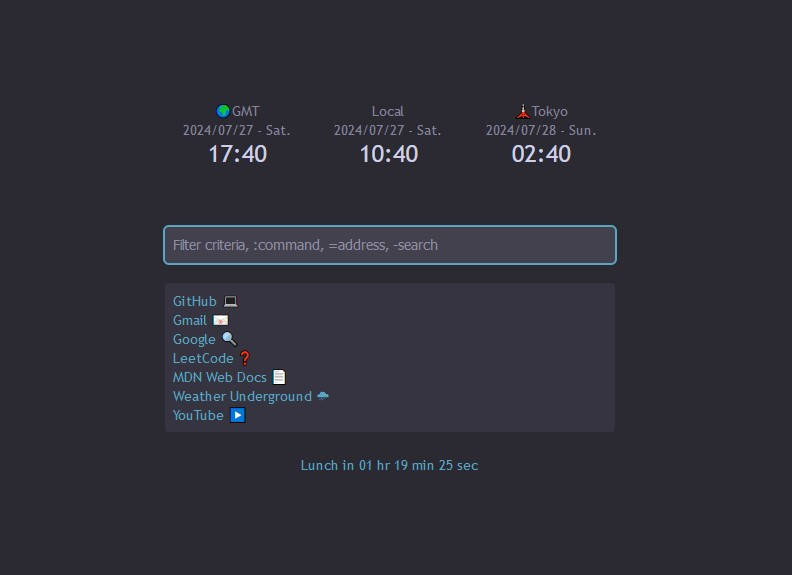

# Homepage Omni

A custom, lightweight homepage/new tab browser extension that lets
you create and access quick links via an omnibar

- Productive: keyboard-based mouse-free interaction, available at any new tab page
- Customizable: add any links
- Private: nothing you type in the bar is recorded

:warning: This is a new in-progress project; not all of the commands and features listed are added yet.

## Installation

This extension should work on either Firefox or Chrome, but is currently only tested in Firefox.

To test out the extension on Firefox:
1. Download this source code
2. In Firefox, go to `about:debugging`
3. Go to the This Firefox section and click `Load Temporary Add-on...`
4. Upload this `manifest.json` file.

To add the extension to Chrome:
1. Download this source code
2. Go to `chrome://extensions`
3. Turn on Developer Mode in the top right
4. In the top left, Load Unpacked and upload this entire folder

Improved installation instructions will be added once this project becomes more complete.

## Commands

Type any string to filter through the list of links (described below); press enter to go to the link

The up and down arrow keys can be used to switch between links from the filtered list

Commands are prefixed with `:`.
- `:show` - Show all links by default (when the omnibar is empty)
- `:hide` - Hide all links by default
- `:set {link name} {link URL}` - Add or change a link with the given name
- `:delete {link name}` - Delete the link with the given name
- `:export` - Export/save the list of links to a .csv file
- `:import` - Import/load the list of links from a .csv file

Addresses are prefixed with `=`.
- `=example.com` - Go to https://example.com

Web searches are prefixed with `-`.
- `-marsupials` - Google search for "marsupials"

## Filtering Method

The links are filtered using these rules:
- Only links that contain the inputted filter string
- Case insensitive
- Left and right trimmed for spaces

The links are sorted using these rules:
- All links *starting* with the filter come first
- Sorted alphabetically
- Example: when searching "list", "List of fruits" comes before "Apples and oranges list"
